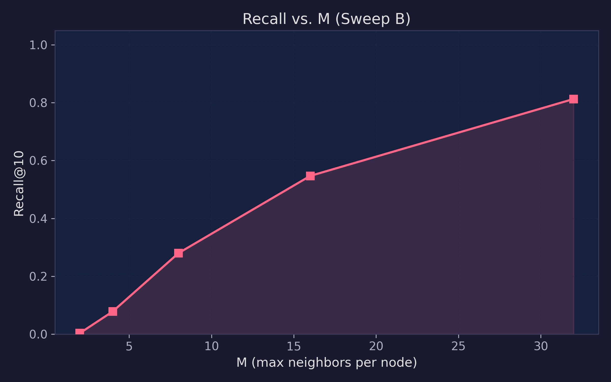
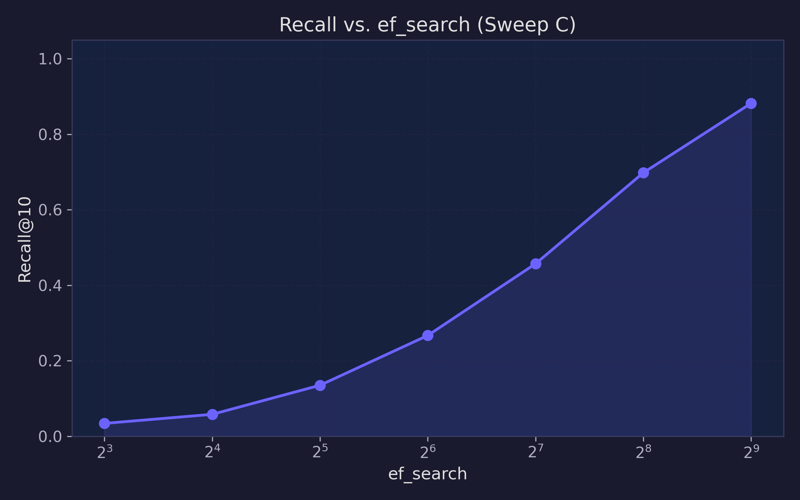
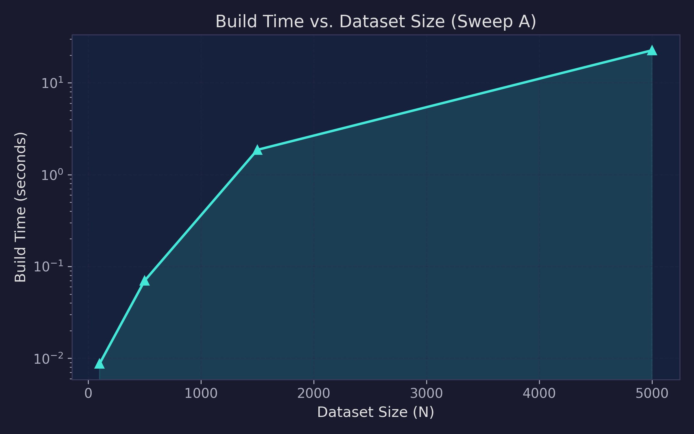
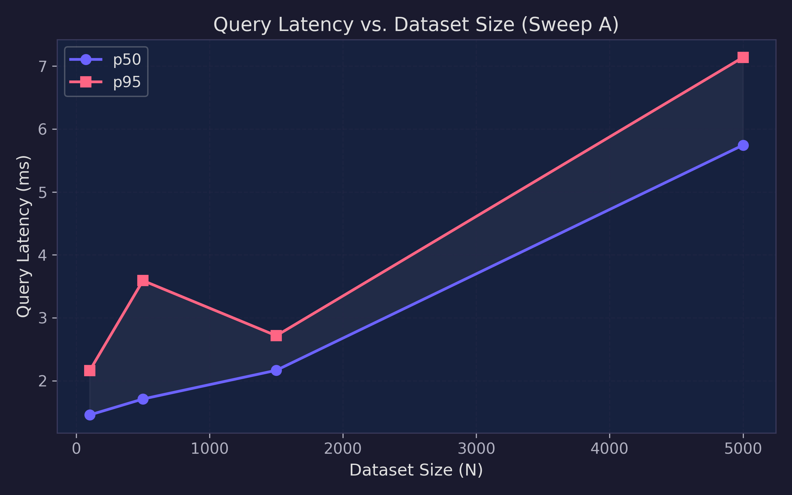
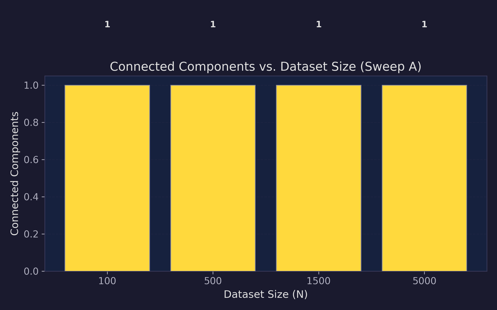

# 🚀 Vector Search Engine

An AI-native semantic retrieval engine built from scratch in Python.

This project explores the core infrastructure behind modern Retrieval-Augmented Generation (RAG) systems by implementing vector embeddings, cosine similarity search, and Approximate Nearest Neighbor (ANN) retrieval without relying on external vector databases.

Currently implemented:
- Batch embedding pipeline using SentenceTransformers
- Exact cosine similarity search using NumPy
- Modular indexing architecture
- Top-k semantic document retrieval

Planned:
- Graph-based ANN index (NSW/HNSW-inspired)
- FastAPI retrieval API
- Benchmarking suite
- RAG integration

## Example Retrieval

Query:
> "How do I bake bread?"

Top Results:
1. "To get a crispy crust on homemade bread..."
2. "Sourdough bread requires a healthy starter..."

---

## 📊 Performance Benchmarking & Bottleneck Analysis

To evaluate the empirical performance, systemic constraints, and scalability limits of both index architectures, a structured benchmark was executed using high-dimensional synthetic vector datasets ($D = 384$, normalized to unit length).

The evaluation was categorized into three distinct scale tiers: **Simple** ($N=100$), **Medium** ($N=1,500$), and **Hard** ($N=8,000$).

### 💻 Benchmark Environment

* **OS:** Windows 11 Home
* **Hardware:** Acer Aspire 5
* **Python Runtime:** Python 3.12+
* **Numerical Backend:** NumPy vectorized operations accelerated through optimized BLAS/LAPACK routines.

### 📈 Empirical Results

| Metric                           | Index Type   | Simple ($N=100$) | Medium ($N=1,500$) | Hard ($N=8,000$) |
| :------------------------------- | :----------- | :--------------- | :----------------- | :--------------- |
| **Build Time (Ingestion)**       | `ExactIndex` | 0.0002 sec       | 0.0032 sec         | 0.0208 sec       |
|                                  | `GraphIndex` | 0.0120 sec       | 7.1926 sec         | **186.0596 sec** |
| **Query Latency**                | `ExactIndex` | **0.45 ms**      | 2.96 ms            | 15.27 ms         |
|                                  | `GraphIndex` | 1.19 ms          | **2.12 ms**        | **11.84 ms**     |
| **Recall Rate (Top-5 Accuracy)** | `GraphIndex` | 60.0%            | 20.0%              | 20.0%            |

### 📉 Benchmark Visualizations

### 🔍 Key Findings

* **Exact vector search remains surprisingly competitive** at small-to-medium scales due to highly optimized dense linear algebra operations.
* **Graph-based ANN traversal shows early evidence of improved search scaling behavior** over brute-force matrix evaluation as dataset size increases.
* **The flat NSW insertion strategy suffers from a severe quadratic build-time scaling bottleneck** during batch ingestion.
* **High-dimensional recall degradation highlights the limitations of shallow graph routing** when traversing complex embedding spaces ($D=384$).

---

### Deep Architectural Interpretation & Bottlenecks

#### 1. Ingestion Throughput and the Quadratic ($O(N^2)$) Bottleneck

While the `ExactIndex` leverages highly efficient contiguous matrix operations during insertion, the `GraphIndex` initialization encounters a severe quadratic scaling barrier, requiring **186.05 seconds** to ingest 8,000 items. This is an explicit architectural bottleneck: the flat graph constructor performs a full proximity scan for every incoming node against all previously indexed vectors to establish its initial $M$ bidirectional edges, causing insertion complexity to scale quadratically.

#### 2. Search Scaling Characteristics

The empirical query metrics demonstrate the computational advantage of graph-based routing at larger scales. At $N=8,000$, the `GraphIndex` achieved a retrieval latency of **11.84 ms**, outperforming the brute-force baseline of **15.27 ms**. The benchmark suggests that graph traversal increasingly benefits from skipping irrelevant regions of the embedding space as dataset size expands.

#### 3. Topology-Induced Recall Degradation

The custom flat proximity graph experienced a sharp drop in retrieval accuracy, leveling off at a **20.0% Recall Rate** on larger vector clusters. In high-dimensional embedding spaces, dense semantic clusters can trap greedy searches in locally optimal regions. The low recall indicates that the current flat graph topology and bounded best-first routing strategy struggle to consistently escape these local regions before converging.

---

### 🗺️ Future Optimization Directions

To overcome the execution bottlenecks and topological constraints exposed by this benchmark, the engine roadmap targets two major areas of improvement:

1. **Algorithmic Refinement (HNSW):** Transitioning from a flat NSW structure to a hierarchical multi-layer proximity graph (Hierarchical Navigable Small World - HNSW) to improve long-range routing efficiency and retrieval recall.
2. **Systems Optimization (FAISS Integration):** Offloading vector search operations to optimized low-level C++ libraries such as FAISS to leverage SIMD acceleration, multi-threading, and memory-efficient vector quantization techniques.

## 🔬 Benchmarking Framework

To move beyond basic validation, a dedicated, reproducible benchmarking suite was engineered to mathematically map the absolute limits of the native Python Navigable Small World (NSW) architecture.

This framework evaluates the system across multiple operational axes:
- **Dataset scaling behavior:** Profiling $O(N^2)$ build time explosions and sub-linear query scaling.
- **Graph density (`M`):** Measuring the threshold between graph fracturing and memory overhead.
- **Search breadth (`ef_search`):** Profiling the Python interpreter loop overhead vs. recall precision.
- **Construction breadth (`ef_construction`):** Tracing insertion routing quality.
- **Dimensionality effects:** Observing the "Curse of Dimensionality" as embeddings scale.
- **Graph connectivity:** Using graph traversal to track isolated components and undirected edge integrity.
- **Recall vs. Latency tradeoffs:** Establishing the absolute limits of pure Python execution.

**The suite automatically generates:**
- Timestamped, seed-controlled JSON experiment logs (`outputs/raw/` and `outputs/aggregated/`).
- Low-level graph diagnostics (Asymmetric edges, Degree distribution, Reachability).
- Automated Matplotlib analytical plots.
- Cross-cluster "Escape Success" matrices to evaluate local minima routing.

### 📊 Key Empirical Findings

| Diagnostic Metric | Empirical Observation | Systems Conclusion |
| :--- | :--- | :--- |
| **Topology (`M`)** | Increasing `M` from 2 → 32 improved recall from **0.3% to 81.3%**. | Sparse graphs ($M=2$) shatter into thousands of isolated components. Dense graphs heal the topology but drastically increase Python loop latency during greedy search. |
| **Search Beam (`ef_search`)** | Increasing `ef_search` from 8 → 512 improved recall from **3.4% to 88.2%**. | Wide exploration significantly improves recall at the cost of increased traversal latency but chokes the Python interpreter, ultimately causing search times to scale slower than brute-force exact matrix math. |
| **Dimensionality Curse** | Recall degraded significantly as embedding dimensionality increased from **128D to 1536D**. | In high-dimensional manifolds, equidistant vectors trap the greedy search, dropping accuracy and exploding distance calculation overhead during ingestion. |
| **Local Minima Escape** | The cross-cluster "Escape Matrix" demonstrated near **0% success** when attempting to route between distant clusters. | A flat NSW graph cannot reliably escape dense gravity wells. **The results highlight the limitations of a flat NSW topology and motivate hierarchical routing approaches such as HNSW.** |

### 📈 Telemetry Visualizations

*(Visualizations generated automatically via the telemetry suite)*

  
  

  
  

  

### Reproducibility

All experiments are deterministic and versioned.

Each benchmark run records:
- Random seed
- Git commit hash
- Timestamp
- Hyperparameters
- Raw per-query telemetry
- Aggregated metrics