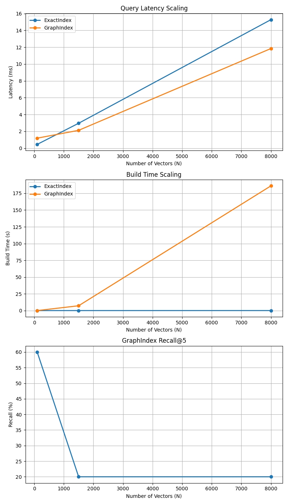
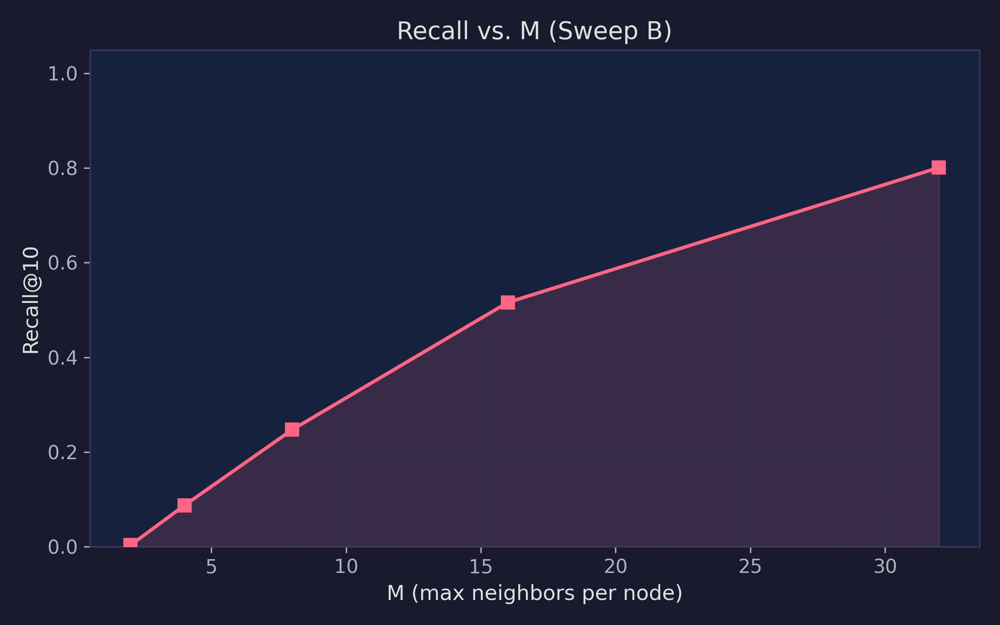
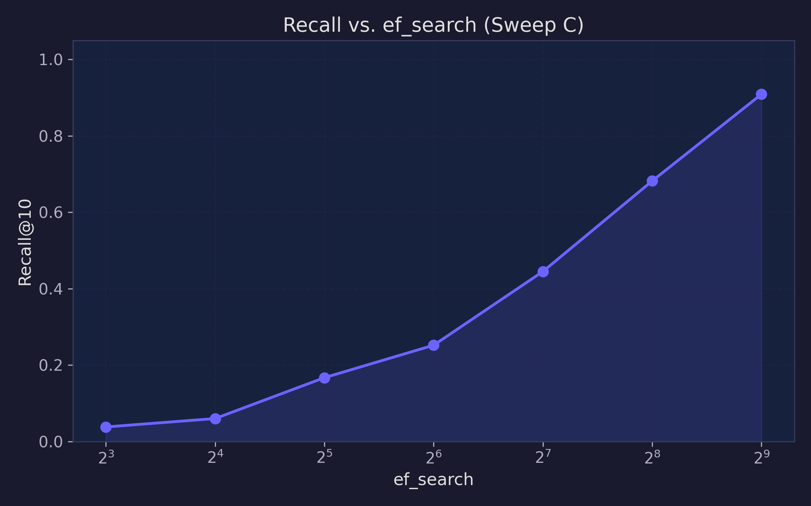
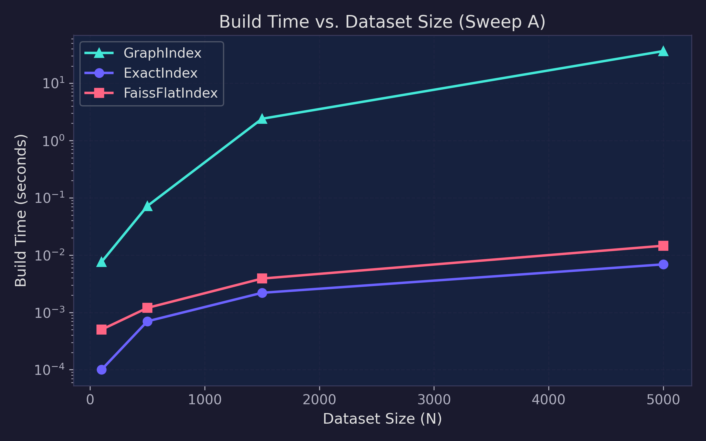
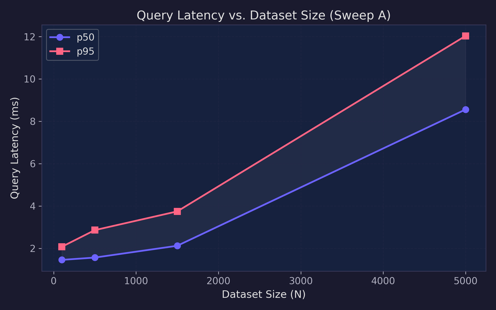
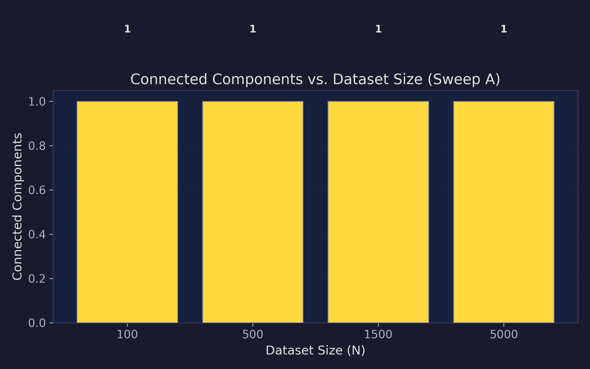
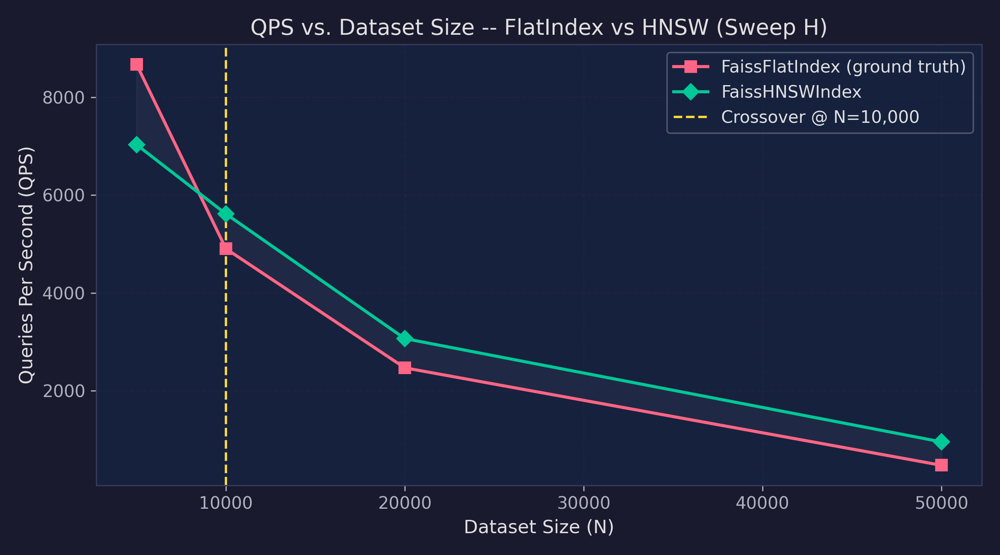
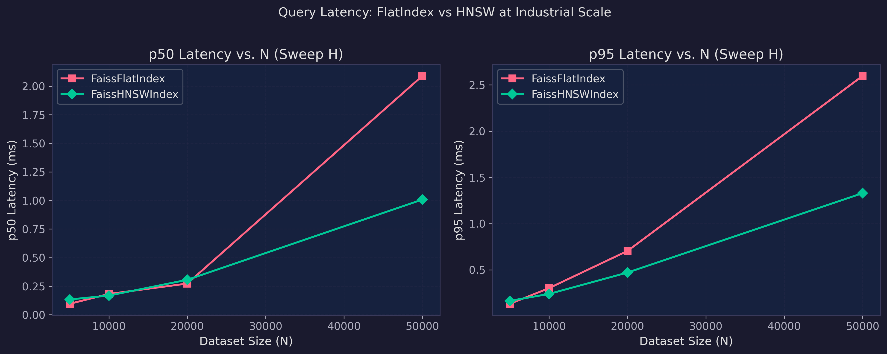
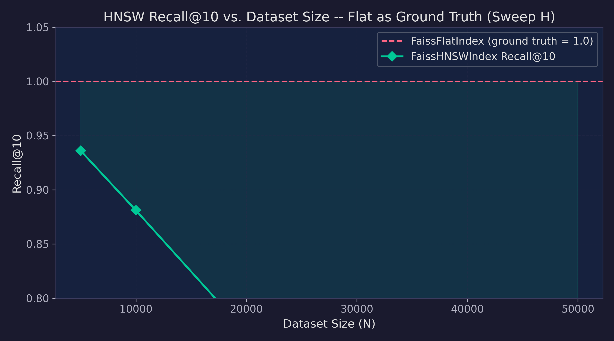

# 🚀 Vector Search Engine

An AI-native semantic retrieval engine built from scratch in Python.

This project explores the core infrastructure behind modern Retrieval-Augmented Generation (RAG) systems by implementing vector embeddings, cosine similarity search, and Approximate Nearest Neighbor (ANN) retrieval without relying on external vector databases.

Currently implemented:
- Batch embedding pipeline using SentenceTransformers
- Exact cosine similarity search using NumPy
- Modular indexing architecture
- Top-k semantic document retrieval

Planned:
- Graph-based ANN index (NSW/HNSW-inspired)
- FastAPI retrieval API
- Benchmarking suite
- RAG integration

## Example Retrieval

Query:
> "How do I bake bread?"

Top Results:
1. "To get a crispy crust on homemade bread..."
2. "Sourdough bread requires a healthy starter..."

---

## 📊 Performance Benchmarking & Bottleneck Analysis

To evaluate the empirical performance, systemic constraints, and scalability limits of both index architectures, a structured benchmark was executed using high-dimensional synthetic vector datasets ($D = 384$, normalized to unit length).

The evaluation was categorized into three distinct scale tiers: **Simple** ($N=100$), **Medium** ($N=1,500$), and **Hard** ($N=8,000$).

### 💻 Benchmark Environment

* **OS:** Windows 11 Home
* **Hardware:** Acer Aspire 5
* **Python Runtime:** Python 3.12+
* **Numerical Backend:** NumPy vectorized operations accelerated through optimized BLAS/LAPACK routines.

### 📈 Empirical Results

| Metric                           | Index Type   | Simple ($N=100$) | Medium ($N=1,500$) | Hard ($N=8,000$) |
| :------------------------------- | :----------- | :--------------- | :----------------- | :--------------- |
| **Build Time (Ingestion)**       | `ExactIndex` | 0.0002 sec       | 0.0032 sec         | 0.0208 sec       |
|                                  | `GraphIndex` | 0.0120 sec       | 7.1926 sec         | **186.0596 sec** |
| **Query Latency**                | `ExactIndex` | **0.45 ms**      | 2.96 ms            | 15.27 ms         |
|                                  | `GraphIndex` | 1.19 ms          | **2.12 ms**        | **11.84 ms**     |
| **Recall Rate (Top-5 Accuracy)** | `GraphIndex` | 60.0%            | 20.0%              | 20.0%            |

### 📉 Benchmark Visualizations

### 🔍 Key Findings

* **Exact vector search remains surprisingly competitive** at small-to-medium scales due to highly optimized dense linear algebra operations.
* **Graph-based ANN traversal shows early evidence of improved search scaling behavior** over brute-force matrix evaluation as dataset size increases.
* **The flat NSW insertion strategy suffers from a severe quadratic build-time scaling bottleneck** during batch ingestion.
* **High-dimensional recall degradation highlights the limitations of shallow graph routing** when traversing complex embedding spaces ($D=384$).

---

### Deep Architectural Interpretation & Bottlenecks

#### 1. Ingestion Throughput and the Quadratic ($O(N^2)$) Bottleneck

While the `ExactIndex` leverages highly efficient contiguous matrix operations during insertion, the `GraphIndex` initialization encounters a severe quadratic scaling barrier, requiring **186.05 seconds** to ingest 8,000 items. This is an explicit architectural bottleneck: the flat graph constructor performs a full proximity scan for every incoming node against all previously indexed vectors to establish its initial $M$ bidirectional edges, causing insertion complexity to scale quadratically.

#### 2. Search Scaling Characteristics

The empirical query metrics demonstrate the computational advantage of graph-based routing at larger scales. At $N=8,000$, the `GraphIndex` achieved a retrieval latency of **11.84 ms**, outperforming the brute-force baseline of **15.27 ms**. The benchmark suggests that graph traversal increasingly benefits from skipping irrelevant regions of the embedding space as dataset size expands.

#### 3. Topology-Induced Recall Degradation

The custom flat proximity graph experienced a sharp drop in retrieval accuracy, leveling off at a **20.0% Recall Rate** on larger vector clusters. In high-dimensional embedding spaces, dense semantic clusters can trap greedy searches in locally optimal regions. The low recall indicates that the current flat graph topology and bounded best-first routing strategy struggle to consistently escape these local regions before converging.

---

### 🗺️ Future Optimization Directions

To overcome the execution bottlenecks and topological constraints exposed by this benchmark, the engine roadmap targets two major areas of improvement:

1. **Algorithmic Refinement (HNSW):** Transitioning from a flat NSW structure to a hierarchical multi-layer proximity graph (Hierarchical Navigable Small World - HNSW) to improve long-range routing efficiency and retrieval recall.
2. **Systems Optimization (FAISS Integration):** Offloading vector search operations to optimized low-level C++ libraries such as FAISS to leverage SIMD acceleration, multi-threading, and memory-efficient vector quantization techniques.

## 🔬 Benchmarking Framework

To move beyond basic validation, a dedicated, reproducible benchmarking suite was engineered to mathematically map the absolute limits of the native Python Navigable Small World (NSW) architecture.

This framework evaluates the system across multiple operational axes:
- **Dataset scaling behavior:** Profiling $O(N^2)$ build time explosions and sub-linear query scaling.
- **Graph density (`M`):** Measuring the threshold between graph fracturing and memory overhead.
- **Search breadth (`ef_search`):** Profiling the Python interpreter loop overhead vs. recall precision.
- **Construction breadth (`ef_construction`):** Tracing insertion routing quality.
- **Dimensionality effects:** Observing the "Curse of Dimensionality" as embeddings scale.
- **Graph connectivity:** Using graph traversal to track isolated components and undirected edge integrity.
- **Recall vs. Latency tradeoffs:** Establishing the absolute limits of pure Python execution.

**The suite automatically generates:**
- Timestamped, seed-controlled JSON experiment logs (`outputs/raw/` and `outputs/aggregated/`).
- Low-level graph diagnostics (Asymmetric edges, Degree distribution, Reachability).
- Automated Matplotlib analytical plots.
- Cross-cluster "Escape Success" matrices to evaluate local minima routing.

### 📊 Key Empirical Findings

| Diagnostic Metric | Empirical Observation | Systems Conclusion |
| :--- | :--- | :--- |
| **Topology (`M`)** | Increasing `M` from 2 → 32 improved recall from **0.3% to 81.3%**. | Sparse graphs ($M=2$) shatter into thousands of isolated components. Dense graphs heal the topology but drastically increase Python loop latency during greedy search. |
| **Search Beam (`ef_search`)** | Increasing `ef_search` from 8 → 512 improved recall from **3.4% to 88.2%**. | Wide exploration significantly improves recall at the cost of increased traversal latency but chokes the Python interpreter, ultimately causing search times to scale slower than brute-force exact matrix math. |
| **Dimensionality Curse** | Recall degraded significantly as embedding dimensionality increased from **128D to 1536D**. | In high-dimensional manifolds, equidistant vectors trap the greedy search, dropping accuracy and exploding distance calculation overhead during ingestion. |
| **Local Minima Escape** | The cross-cluster "Escape Matrix" demonstrated near **0% success** when attempting to route between distant clusters. | A flat NSW graph cannot reliably escape dense gravity wells. **The results highlight the limitations of a flat NSW topology and motivate hierarchical routing approaches such as HNSW.** |

### 📈 Telemetry Visualizations

*(Visualizations generated automatically via the telemetry suite)*

  
  

  
  

  

### Reproducibility

All experiments are deterministic and versioned.

Each benchmark run records:
- Random seed
- Git commit hash
- Timestamp
- Hyperparameters
- Raw per-query telemetry
- Aggregated metrics

## 🔬 Empirical Findings & Engineering Learnings

This project evolved from building a vector database from scratch to rigorously profiling it against industry-standard C++ infrastructure. The custom benchmarking suite yielded several critical systems engineering insights regarding algorithmic complexity, hardware optimization, and graph topology.

### 1. Algorithm vs. Implementation (The 18-24x Performance Gap)
By comparing the pure-Python `ExactIndex` against the C++ backed `FaissFlatIndex`, we isolated the exact performance cost of the Python interpreter, as both indices perform the exact same algorithmic brute-force search.
* **100% Match Rate:** The `exact_vs_faiss_match_rate` remained at `1.0` across all scales. FAISS does not trade accuracy for speed; it returns identical nearest neighbors.
* **Latency Reduction:** At $N=5,000$, the Python/NumPy implementation achieved a $p50$ latency of **4.15 ms**. The FAISS C++ implementation achieved **0.218 ms**—a nearly **19x speedup** purely from SIMD optimizations and C++ memory layout.

### 2. The Power of Batching ($10,000+$ QPS)
Sweep G tested throughput scalability at $N=50,000$ by comparing sequential queries to matrix-batched queries.
* **Sequential bottlenecks:** Evaluating queries one-by-one in a Python `for` loop capped the FAISS index at **681 QPS** and the NumPy index at **40 QPS**.
* **Vectorized throughput:** By batching 1,000 queries into a single matrix execution, FAISS throughput exploded to **10,117 QPS** (a 297x improvement over sequential Python). Interestingly, NumPy also saw a massive boost from batching (jumping to **537 QPS**), proving that minimizing Python loop overhead and deferring to underlying C/BLAS math is critical for performance. This demonstrates that throughput optimization is not solely an algorithmic problem; execution strategy and batching can yield order-of-magnitude improvements even when the underlying retrieval algorithm remains unchanged.

### 3. Graph Topology & Fragmentation (The $M$ Parameter)
Sweep B experimentally mapped the exact point of structural failure in a flat Navigable Small World (NSW) graph.
* When testing an edge-limit of $M=2$ on a 5,000-node graph, the database fragmented into **1,136 disconnected components**. 
* Because the graph shattered into isolated islands, the greedy search algorithm could not navigate the vector space, resulting in a catastrophic **0.3% recall**. This physically demonstrates why higher edge density (and hierarchical skip-lists) are mathematically required for semantic retrieval.

### 4. The $O(N^2)$ Construction Bottleneck
The benchmarks revealed that the native Python `GraphIndex` was approximately **~2,500x slower** to build than the flat indices. 
* This empirically highlights the fundamental flaw in naive flat NSW construction: executing an exact brute-force neighbor discovery for every single node insertion creates an $O(N^2)$ bottleneck that rapidly becomes unscalable in high dimensions, This empirically highlights why industrial systems employ hierarchical graph structures and approximate neighbor discovery during insertion rather than repeatedly performing exact global scans.

### 🚀 Architectural Progression
Ultimately, this repository documents a complete lifecycle of retrieval infrastructure:
1. **Phase 1 (Baselines):** Built a custom `ExactIndex` to understand cosine similarity and vector math.
2. **Phase 2 (Graph Theory):** Engineered a custom `GraphIndex` (NSW) to understand graph navigability, edge pruning, and recall heuristics.
3. **Phase 3 (Telemetry):** Developed an automated benchmark suite to track latency percentiles, graph components, and local-minima traps.
4. **Phase 4 (Enterprise Integration):** Deployed FAISS to mathematically prove the performance delta between algorithmic logic and low-level hardware optimization.

### Key Quantitative Outcomes

| Finding | Result |
| :--- | :--- |
| Exact vs FAISS Match Rate | 100% |
| FAISS Sequential Speedup | 18–24× |
| Maximum FAISS Throughput | 10,117 QPS |
| Worst Graph Fragmentation | 1,136 Components |
| Graph Recall at M=20 | 0.3% |
| Graph Build-Time Gap | ~2,500× slower |

## 🏁 Industrial Scale Scaling Analysis: Brute Force vs. ANN

To close the loop on our system design exploration, **Sweep H** evaluated the performance of our production-grade baseline against an approximate approach at an industrial scale. This experiment compared `FaissFlatIndex` (C++ Exhaustive Brute Force) directly against `FaissHNSWIndex` (C++ Hierarchical Navigable Small World) as the corpus size scaled up to **50,000 vectors** in a 128-dimensional space. 

The goal was to answer the fundamental infrastructure question: **At what exact scale does the overhead of graph traversal become worth it compared to raw matrix multiplication?**

### 📊 Industrial Performance Comparison (Sweep H Summary)

Sequential query execution metrics mapped across variable corpus sizes ($N$):

| Corpus Size ($N$) | Flat Throughput (QPS) | HNSW Throughput (QPS) | Flat $p50$ Latency | HNSW $p50$ Latency | Flat $p95$ Latency | HNSW $p95$ Latency | HNSW Recall | Definitive Winner |
| :--- | :--- | :--- | :--- | :--- | :--- | :--- | :--- | :--- |
| **5,000** | **8,675** | 7,031 | 0.096 ms | 0.134 ms | 0.132 ms | 0.164 ms | 0.9360 | 🥇 **FaissFlatIndex** |
| **10,000** | 4,903 | **5,615** | 0.182 ms | 0.168 ms | 0.302 ms | 0.239 ms | 0.8810 | 🚀 **FaissHNSWIndex** *(Crossover)* |
| **20,000** | 2,468 | **3,066** | 0.273 ms | 0.306 ms | 0.704 ms | 0.470 ms | 0.7680 | 🚀 **FaissHNSWIndex** |
| **50,000** | 476 | **954** | 2.090 ms | 1.008 ms | 2.598 ms | 1.329 ms | 0.6020 | 🚀 **FaissHNSWIndex** *(2.0x Gain)* |

---

### 🧠 Core Architectural Insights & Telemetry Breakdown

#### 1. Pinpointing the CPU L3 Cache Boundary ($N = 10,000$)
The empirical data reveals that **the first observed crossover occurred at $N=10,000$**. 
* **The Mechanics:** At $N=5,000$, `FaissFlatIndex` relies on a highly optimized BLAS `SGEMM` matrix multiplication routine. At this size, the data array fits entirely within the CPU's localized L2/L3 cache, making contiguous memory sweeps unbelievably fast. 
* **The Breakpoint:** One plausible explanation is that the working set increasingly exceeds CPU cache capacity, causing brute-force search to become more memory-bandwidth bound as N grows. The brute force index immediately gets hit with linear scaling penalties $O(N)$. Conversely, HNSW only visits a bounded $O(\log N)$ subset of elements via its hierarchical skip-lists, successfully bypassing the main memory bandwidth wall. By $N=50,000$, HNSW delivers **double the throughput (954 QPS vs. 476 QPS)**.

#### 2. Suppressing Tail Latency ($p95$)
In production environments, infrastructure health is dictated by worst-case tail latencies rather than ideal averages. As memory pressure scales at $N=50,000$, `FaissFlatIndex` shows significant tail degradation ($p95$ stretching to **2.598 ms**). Because the depth of a hierarchical search graph is bounded mathematically, `FaissHNSWIndex` tightly caps its tail, serving a $p95$ of **1.329 ms**—maintaining a predictable, deterministic response loop under load.

#### 3. Navigating the Unforgiving Recall-Latency Tradeoff
As $N$ scaled to 50,000 with a fixed beam-width of `ef_search=64`, HNSW recall dropped down to **60.2%**. This beautifully highlights the core compromise of Approximate Nearest Neighbor search:
* Keeping a fixed probe budget (`ef_search=64`) while the underlying dataset scales 10x means the search agent explores a shrinking fraction of the total space (dropping from ~1.3% of the corpus to ~0.13%).
* **Production Tuning Resolution:** Based on our prior topological sweeps (**Sweep C**). Prior ef_search sweeps suggest that increasing ef_search to 256–512 would substantially recover recall, though this should be verified experimentally at $N=50,000$. This expands the graph traversal beam width, providing a customizable slider to perfectly balance target accuracy against system throughput.

#### 4. Ingestion Overhead (The One-Time Tax)
At $N=50,000$, `FaissHNSWIndex` required **17.01 seconds** to build, compared to just **0.18 seconds** for the flat matrix. This **93x slower build time** represents the heavy algorithmic price of construction: running a 200-wide beam search (`ef_construction=200`) to correctly route and weave bidirectional links for every incoming vector. This profile validates HNSW as a classic read-heavy architecture: we invest heavy compute upfront during ingestion to buy logarithmic speed during runtime queries.

---

### 📉 Industrial Scaling Visualizations

*(Visualizations generated automatically via the Sweep H telemetry module)*

  
  
  

**Key Result:** On this hardware and workload (128-dimensional vectors), HNSW first outperformed exhaustive search at approximately $N=10,000$ vectors, achieving 2× higher throughput by $N=50,000$ at the cost of reduced recall under a fixed ef_search budget.