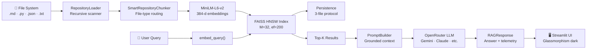

# 🔍 Semantic Retrieval Engine

**A from-scratch implementation of a vector search engine and RAG platform, built to learn — and empirically prove — how retrieval infrastructure actually works.**


---

## Why This Project Exists

Most RAG tutorials stop at `pip install pinecone-client`. This project takes the opposite approach: **build every layer from scratch, benchmark it, then replace components with industrial implementations and measure the delta.**

The result is a codebase that documents its own evolution — from a naive O(N²) graph index that takes 186 seconds to build 8,000 vectors, to a FAISS-backed HNSW index serving 10,117 queries per second. Every architectural claim is backed by seeded, reproducible benchmark data.

**What this project demonstrates:**

- Implementing NSW graph search from zero and watching it fail at scale (Sweep B: graph fractures into 1,136 components at M=2)
- Quantifying the exact performance cost of the Python interpreter (18–24× slower than C++ for the same brute-force algorithm)
- Pinpointing the N≈10,000 corpus size where HNSW first outperforms exhaustive search
- Building a file-type-aware ingestion pipeline that respects Markdown headers, Python function boundaries, and JSON structure
- Wiring retrieval to LLM generation through a grounded prompt builder with full telemetry

---

## 📸 Screenshots

> **Streamlit UI, Benchmark Graphs, and Architecture Diagram screenshots are planned.**
> Benchmark chart PNGs are available in `benchmarks/outputs/figures/`.

---

## ✨ Features

### Retrieval & Indexing
- **4 index backends** — `ExactIndex` (NumPy brute-force), `GraphIndex` (manual NSW), `FaissFlatIndex` (C++ exact), `FaissHNSWIndex` (C++ HNSW) — all behind a single `BaseIndex` ABC
- **O(log N) approximate search** via FAISS HNSW with configurable M, ef_construction, and ef_search
- **Three-file persistence** — FAISS binary graph + pickled documents + JSON metadata, independently inspectable

### Smart Ingestion
- **File-type-aware routing chunker** — dispatches `.md` → header-aware splitting, `.py` → AST/function-aware splitting, `.json/.jsonl` → whole-document, `.txt` → paragraph fallback
- **JSON-to-prose rendering** — converts benchmark JSON into natural-language paragraphs before embedding (embedding models are trained on English, not `{curly braces}`)
- **384-d MiniLM embeddings** via SentenceTransformers with a deterministic mock counterpart for offline development

### RAG Pipeline
- **Stateless orchestrator** — `query()` → embed → search → build prompt → generate → return telemetry
- **Grounded prompt construction** — numbered context blocks with similarity scores and explicit anti-hallucination instructions
- **OpenRouter LLM gateway** — access to hundreds of models (Gemini, Claude, DeepSeek) with three-tier key resolution and graceful fallback to a zero-network mock simulator

### Streamlit UI
- **Glassmorphism dark theme** with Inter/JetBrains Mono typography
- **Live model discovery** — fetches available models from OpenRouter's catalogue with free-tier filtering
- **Four-pillar telemetry** — every query displays indexed chunks, constructed context, query echo, and generated answer with per-model token breakdown
- **File upload with live re-indexing** — supports `.txt`, `.md`, `.pdf`, `.json`, `.jsonl`

### Benchmarking (The Lab)
- **8 sweep functions** (A–H) covering scaling, topology, traversal, escape dynamics, dimensionality, implementation quality, batching, and industrial crossover
- **Deterministic reproducibility** — seeded RNG, git-commit tracking, timestamped JSON outputs
- **10 auto-generated charts** with dark theme at 300 DPI

---

## 🏗️ System Architecture


```mermaid
graph LR
    A["📁 File System<br/>.md · .py · .json · .txt"] --> B["RepositoryLoader<br/>Recursive scanner"]
    B --> C["SmartRepositoryChunker<br/>File-type routing"]
    C --> D["MiniLM-L6-v2<br/>384-d embeddings"]
    D --> E["FAISS HNSW Index<br/>M=32, ef=200"]
    E --> F["Persistence<br/>3-file protocol"]

    G["🔎 User Query"] --> H["embed_query()"]
    H --> E
    E --> I["Top-K Results"]
    I --> J["PromptBuilder<br/>Grounded context"]
    J --> K["OpenRouter LLM<br/>Gemini · Claude · etc."]
    K --> L["RAGResponse<br/>Answer + telemetry"]
    L --> M["🖥️ Streamlit UI<br/>Glassmorphism dark"]
```

### Architectural Layers

```
┌─────────────────────────────────────────────────────┐
│              Presentation — Streamlit UI             │
├─────────────────────────────────────────────────────┤
│           Orchestration — RAGPipeline                │
├───────────────┬──────────────┬──────────────────────┤
│  Embedding    │   Indexing   │     Generation        │
│  Service      │   Backend    │     Backend           │
│  (MiniLM)     │  (FAISS)     │     (OpenRouter)      │
├───────────────┴──────────────┴──────────────────────┤
│          Data Model — TextChunk → Document           │
└─────────────────────────────────────────────────────┘
```

Every service domain is behind an abstract interface with constructor injection, enabling transparent swaps between mock (offline, deterministic) and production (MiniLM + FAISS HNSW + OpenRouter) backends.

---

## 📖 Deep Dive Documentation

This repository includes a detailed engineering walkthrough in [`docs/deep_dive/`](docs/deep_dive/):

| Document | Description |
|:---|:---|
| [00 — Coverage Ledger](docs/deep_dive/00_coverage_ledger.md) | Exhaustive file-by-file inventory of every artifact |
| [01 — Architecture](docs/deep_dive/01_repository_census_and_architecture.md) | Directory topology, dependency graph, layer diagram |
| [02 — Data Models](docs/deep_dive/02_data_models_and_type_system.md) | `TextChunk` → `Document` lifecycle, invariants, serialisation |
| [03 — Ingestion Pipeline](docs/deep_dive/03_ingestion_pipeline.md) | File loading, smart chunking strategies, JSON-to-prose rendering |
| [04 — Indexing Backends](docs/deep_dive/04_indexing_backends_and_algorithms.md) | All 4 index implementations with complexity analysis |
| [05 — LLM & RAG Pipeline](docs/deep_dive/05_llm_abstraction_and_rag_pipeline.md) | LLM abstraction, prompt construction, telemetry chain |
| [06 — Benchmarking Framework](docs/deep_dive/06_benchmarking_framework.md) | Sweep specifications, synthetic data generators, output schemas |
| [07 — Streamlit Application](docs/deep_dive/07_streamlit_application.md) | Boot sequence, session state, CSS design system, component tree |
| [08 — Testing & Quality](docs/deep_dive/08_testing_and_quality.md) | Test suite architecture, smoke tests, diagnostic tools |
| [09 — Interview Handbook](docs/deep_dive/09_interview_handbook.md) | 65 interview questions across 4 difficulty tiers |
| [10 — Executive Summary](docs/deep_dive/10_executive_summary.md) | Project assessment, README audit, maturity evaluation |

---

## 🛤️ Engineering Journey

This repository documents a five-phase evolution from first principles to a working RAG platform:

1. **Phase 1 — Baselines:** Built `ExactIndex` from scratch using NumPy to understand cosine similarity and vector math.
2. **Phase 2 — Graph Theory:** Engineered a manual `GraphIndex` (NSW) to understand graph navigability, then integrated FAISS for `FaissFlatIndex` and `FaissHNSWIndex`.
3. **Phase 3 — Telemetry:** Built an 8-sweep benchmarking framework (1,300+ lines) to systematically map the performance landscape.
4. **Phase 4 — RAG Integration:** Added `OpenRouterLLM`, `PromptBuilder`, `RAGPipeline`, and a Streamlit UI with glassmorphism design.
5. **Phase 5 — Smart Ingestion:** Implemented file-type-aware chunking (`SmartRepositoryChunker`) with a frozen ingestion policy prohibiting universal text splitting.

---

## 🔬 Benchmark Suite (The Lab)

The benchmarking framework is a standalone, read-only consumer of the `src/` APIs — it instruments nothing and modifies no production code. All telemetry is captured via `contextlib.redirect_stdout()`.

<details>
<summary><strong>Sweep A — Scaling (N Sweep)</strong></summary>

**Variable:** N ∈ [100, 500, 1,500, 5,000] · **Indices:** All 4 · **Queries:** 100 per N value

Profiles how all four index implementations scale with corpus size. Measures build time, RSS memory, graph health, query latency percentiles, and recall.

</details>

<details>
<summary><strong>Sweep B — Topology (M Sweep)</strong></summary>

**Variable:** M ∈ [2, 4, 8, 16, 32] · **Fixed:** N=5,000

Maps the threshold between graph fragmentation and memory overhead.

**Key finding:** At M=2, the NSW graph fractures into **1,136 disconnected components** with catastrophic **0.3% recall**. The graph literally shatters into isolated islands.

</details>

<details>
<summary><strong>Sweep C — Traversal (ef_search Sweep)</strong></summary>

**Variable:** ef_search ∈ [8, 16, 32, 64, 128, 256, 512] · **Fixed:** N=5,000, M=8

Profiles the recall-latency tradeoff. Both indices are built once; `ef_search` is mutated in-place per iteration, avoiding redundant graph construction.

</details>

<details>
<summary><strong>Sweep D — Escape Success Matrix</strong></summary>

**Config:** N=5,000, 10 clusters, 5 queries per source cluster

Tests whether the search algorithm can escape dense semantic clusters to find relevant results in distant regions. The flat NSW graph shows **near 0% cross-cluster escape** — demonstrating the local-minima trapping that motivates hierarchical graph structures.

</details>

<details>
<summary><strong>Sweep E — Dimensionality Curse</strong></summary>

**Variable:** dim ∈ [128, 384, 768, 1,536]

Quantifies how increasing dimensionality degrades recall and explodes distance computation overhead during ingestion.

</details>

<details>
<summary><strong>Sweep F — Implementation Quality (Exact vs FAISS)</strong></summary>

**Variable:** N ∈ [5,000 → 50,000] · **Indices:** ExactIndex vs FaissFlatIndex

Isolates the performance cost of the Python interpreter. Both indices perform the **exact same algorithm** (exhaustive brute-force).

**Key finding:** 100% match rate (identical results), **18–24× speedup** from FAISS — purely from SIMD, C++, and cache-friendly memory layout.

</details>

<details>
<summary><strong>Sweep G — Batch Throughput</strong></summary>

**Variable:** batch_size ∈ [1, 10, 100, 1,000] · **Fixed:** N=50,000

Compares sequential vs. matrix-batched query execution.

**Key finding:** FAISS batched throughput reaches **10,117 QPS** — a 297× improvement over sequential Python loop execution. NumPy batching also shows a massive gain (40 → 537 QPS), proving that minimising interpreter overhead is as impactful as the underlying algorithm.

</details>

<details>
<summary><strong>Sweep H — Industrial Scale (Flat vs HNSW)</strong></summary>

**Variable:** N ∈ [5,000, 10,000, 20,000, 50,000] · **Indices:** FaissFlatIndex vs FaissHNSWIndex

Answers: *at what exact corpus size does HNSW outperform brute-force?*

| Corpus Size | Flat QPS | HNSW QPS | HNSW Recall | Winner |
|:---|:---|:---|:---|:---|
| 5,000 | **8,675** | 7,031 | 93.6% | 🥇 Flat |
| 10,000 | 4,903 | **5,615** | 88.1% | 🚀 HNSW *(crossover)* |
| 20,000 | 2,468 | **3,066** | 76.8% | 🚀 HNSW |
| 50,000 | 476 | **954** | 60.2% | 🚀 HNSW *(2× gain)* |

**Key finding:** The crossover occurs at **N ≈ 10,000 vectors**. Below this, FAISS's BLAS-accelerated matrix multiply fits in CPU cache and is faster. Above it, HNSW's O(log N) traversal bypasses the linear scaling wall, delivering **2× throughput at 50K vectors** — at the cost of recall decay under a fixed `ef_search=64` budget.

</details>

### Benchmark Visualisations

<p align="center">
  
  
</p>
<p align="center">
  
  
</p>
<p align="center">
  
  
  
</p>

---

## 🧠 RAG Pipeline & Smart Ingestion

### Ingestion Routing Policy

The chunking strategy is governed by a [frozen policy](docs/ingestion_policy.md) that prohibits universal text splitting:

| File Type | Strategy | Rationale |
|:---|:---|:---|
| `.json` / `.jsonl` | **Whole-Document** (1 file = 1 chunk) | Benchmark data is pre-rendered into prose; splitting would fragment experiment context |
| `.md` | **Header-Aware** (ATX H1/H2/H3 → size guard) | Markdown sections carry semantic signal via headers |
| `.py` | **Language-Aware** (function/class boundaries) | Prevents splitting function definitions across chunks |
| `.txt` / other | **Paragraph Fallback** (`\n\n` → `\n` → `. ` → ` `) | Clean separator hierarchy for generic text |

### Query-Time Pipeline

```
User Query → embed_query() → FAISS index.search(vector, k)
                                    │
                          [(Document, score)]
                                    │
                    PromptBuilder.build_prompt()
                                    │
                     Numbered context blocks with
                     source filenames, scores, and
                     anti-hallucination grounding
                                    │
                     LLM.generate(prompt) → RAGResponse
                     (answer + sources + token telemetry)
```

---

## 🛠️ Technologies

| Category | Technologies |
|:---|:---|
| **Retrieval & Indexing** | FAISS (C++ ANN), NumPy, custom NSW graph |
| **ML & Embeddings** | SentenceTransformers (MiniLM-L6-v2, 384-d), PyTorch |
| **Text Processing** | LangChain Text Splitters (Markdown, Python, Recursive) |
| **LLM Integration** | OpenAI SDK → OpenRouter gateway |
| **UI** | Streamlit (glassmorphism dark theme, Inter + JetBrains Mono) |
| **Benchmarking** | Matplotlib (300 DPI, dark theme), psutil (RSS memory) |
| **Data** | pypdf (PDF ingestion), python-dotenv |
| **Testing** | pytest, 5-phase smoke tests, diagnostic runners |

---

## 🚀 Quick Start

### Prerequisites

- Python ≥ 3.13
- [uv](https://docs.astral.sh/uv/) package manager

### Installation

```bash
git clone https://github.com/Divyansh4518/Semantic-Retrieval-Engine.git
cd Semantic-Retrieval-Engine
uv sync
```

### Environment

Create a `.env` file in the project root:

```
OPENROUTER_API_KEY="sk-or-v1-your-key-here"
```

> Without an API key, the app gracefully falls back to the built-in Mock Simulator — no network required.

### Run the App

```bash
uv run streamlit run app/streamlit_app.py
```

### Run Benchmarks

```bash
uv run python -m benchmarks.runner sweep-h          # Single sweep
uv run python -m benchmarks.runner all               # All 8 sweeps
uv run python -m benchmarks.runner sweep-a --seed 99 # Custom seed
```

### Run Tests

```bash
uv run pytest tests/ -v
```

---

## 💡 Lessons Learned

**HNSW is a read-heavy architecture.** The 93× build-time overhead compared to flat indices is the investment that buys O(log N) query time. This trade-off is ideal for workloads with many reads and infrequent index updates.

**Algorithm vs. implementation is a false dichotomy.** `ExactIndex` and `FaissFlatIndex` run the *same* brute-force algorithm. The 18–24× gap is purely SIMD, C++, and cache layout. Algorithmic analysis without implementation awareness is incomplete.

**Fixed beam width creates recall decay.** A fixed `ef_search=64` explores ~1.3% of a 5K corpus but only ~0.13% of 50K. Production systems must scale `ef_search` with N or accept recall loss as a calibrated trade-off.

**Chunking strategy matters more than chunk size.** Splitting at structural boundaries (headers, function definitions) preserves semantic coherence that embedding models can leverage. A universal text splitter destroys this signal.

**Batching is a systems problem, not an algorithmic one.** Sweep G showed 297× throughput improvement from batching alone — same algorithm, same index, just fewer Python interpreter round-trips.

---

## 🔮 Future Work

- **Cross-encoder re-ranking** — insert a re-ranker between retrieval and generation to improve precision
- **Hybrid BM25 + dense retrieval** — combine term-based scoring with vector search for queries where keyword overlap matters
- **Incremental indexing** — add documents without full index rebuilds
- **Multi-turn conversation** — integrate conversation history into the RAG pipeline
- **SmartRepositoryChunker in the upload path** — align the Streamlit upload flow with the file-type-aware routing used in batch ingestion

---

<p align="center">
  <sub>Built from scratch. Benchmarked to prove it. ~6,500 lines of Python across ~35 source files.</sub>
</p>