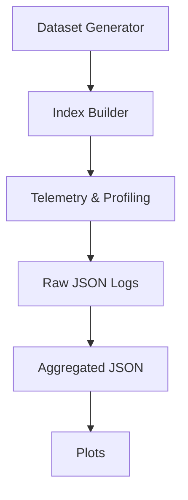

# Benchmarking Suite

A modular benchmarking, telemetry, and plotting infrastructure for evaluating the Navigable Small World (NSW) `GraphIndex`, brute-force `ExactIndex`, and C++ FAISS-backed `FaissFlatIndex`.

> **Zero modifications to `src/`.** This suite is a read-only consumer of the production index APIs.

---

## Directory Structure

```text
benchmarks/
├── README.md              # This file
├── runner.py              # CLI orchestrator — runs sweeps A through G
├── telemetry.py           # Metrics: memory, graph health, latency, recall, QPS, match rate
├── plots.py               # Automated matplotlib chart generation
├── datasets/              # Synthetic data generators (all seeded for reproducibility)
│   ├── __init__.py        # Re-exports: generate_uniform, generate_clustered, generate_at_dimension
│   ├── uniform.py         # L2-normalized random vectors on the unit hypersphere
│   ├── clustered.py       # Gaussian clusters around random centroids
│   └── dimensionality.py  # Wrapper for dimension-variable generation
└── outputs/
    ├── raw/               # Per-query JSONL logs (one JSON object per query)
    ├── aggregated/        # Sweep summary JSON files (one per sweep run)
    └── figures/           # Generated PNG charts (300 DPI, dark theme)
```

---

## Quick Start

```bash
# Run a single sweep
uv run python -m benchmarks.runner sweep-a

# Run all sweeps (A through G)
uv run python -m benchmarks.runner all

# Run with a custom seed
uv run python -m benchmarks.runner sweep-f --seed 123

# Generate plots from existing sweep data
uv run python -m benchmarks.plots
```

## Benchmark Philosophy

This suite is designed as a research-style harness to answer three practical questions about retrieval systems:

1. How does retrieval quality change as graph topology changes?
2. How does retrieval performance scale with dataset size and dimensionality?
3. How much performance comes from algorithmic design versus implementation quality?

Benchmarks are therefore organized into three complementary families: topology sweeps (how `M` and connectivity affect recall), scaling sweeps (how `N` and `dim` affect latency and build time), and implementation-comparison sweeps (Exact vs FAISS and sequential vs batched execution). This helps readers quickly map each sweep to the research question it answers.

## Expected Runtime (approx.)

These are representative runtimes measured on the development machine and are intended only as rough guidance. Actual runtimes will vary depending on hardware and workload characteristics.

| Sweep | Typical Runtime |
| :--- | :--- |
| Sweep A (Scaling) | ~2 min |
| Sweep B (Topology) | ~5 min |
| Sweep C (ef_search) | ~3 min |
| Sweep D (Escape Matrix) | ~4 min |
| Sweep E (Dimensionality) | ~6 min |
| Sweep F (Exact vs FAISS) | ~2 min |
| Sweep G (Batch Throughput) | ~1 min |

## Pipeline Overview




---

## Dependencies

The following packages are required beyond the core project dependencies:

| Package      | Purpose                          |
|-------------|----------------------------------|
| `psutil`     | RSS memory profiling             |
| `matplotlib` | Chart generation                 |
| `faiss-cpu`  | FAISS-backed index (Sweeps F, G) |

Install via:

```bash
uv add psutil matplotlib faiss-cpu
```

---

## CLI Reference

### `runner.py`

```
usage: python -m benchmarks.runner [-h] [--seed SEED]
                                   {sweep-a,sweep-b,sweep-c,sweep-d,sweep-e,sweep-f,sweep-g,all}
```

| Argument    | Description                                          |
|------------|------------------------------------------------------|
| `sweep`    | Which sweep to run, or `all` for the full suite      |
| `--seed`   | Random seed for reproducibility (default: `42`)      |

### `plots.py`

```
usage: python -m benchmarks.plots
```

No arguments. Reads the latest `outputs/aggregated/sweep_*.json` files and generates all available charts.

---

## Sweep Specifications

### Sweep A — Scaling (N Sweep)

Measures how index performance degrades as dataset size grows.

| Parameter        | Value                     |
|-----------------|---------------------------|
| **Fixed**        | M=8, ef_construction=32, ef_search=64, dim=128 |
| **Variable**     | N ∈ [100, 500, 1500, 5000] |
| **Queries**      | 100 per N value           |
| **Indices**      | GraphIndex, ExactIndex, FaissFlatIndex |

**Logged metrics:** Build time (per engine), memory (RSS before/peak/after), graph health, query latency percentiles, recall vs ExactIndex, FAISS QPS, ExactIndex vs FaissFlatIndex match rate.

---

### Sweep B — Topology (M Sweep)

Explores how the max-neighbors parameter affects graph connectivity and recall.

| Parameter        | Value                     |
|-----------------|---------------------------|
| **Fixed**        | N=5000, ef_construction=32, ef_search=64, dim=128 |
| **Variable**     | M ∈ [2, 4, 8, 16, 32]    |
| **Queries**      | 100                       |
| **Indices**      | GraphIndex, ExactIndex    |

**Logged metrics:** Connected components, asymmetric edge count, recall, build time, query latency.

> FaissFlatIndex is **excluded** — it has no graph topology.

---

### Sweep C — Traversal (ef_search Sweep)

Measures the recall-latency trade-off as the search beam width increases.

| Parameter        | Value                      |
|-----------------|----------------------------|
| **Fixed**        | N=5000, M=8, ef_construction=32, dim=128 |
| **Variable**     | ef_search ∈ [8, 16, 32, 64, 128, 256, 512] |
| **Queries**      | 100                        |
| **Indices**      | GraphIndex, ExactIndex     |

**Logged metrics:** Recall, query latency percentiles. The graph is built once and `ef_search` is adjusted per sweep point.

> FaissFlatIndex is **excluded**.

---

### Sweep D — Escape Success Matrix

Tests the graph's ability to traverse between distinct clusters.

| Parameter        | Value                      |
|-----------------|----------------------------|
| **Fixed**        | N=5000, M=8, ef_construction=32, ef_search=64, dim=128, 10 clusters |
| **Variable**     | source_cluster × target_cluster (10×10 matrix) |
| **Queries**      | 5 per source cluster       |
| **Indices**      | GraphIndex                 |

**Definition:** For a query from `source_cluster`, "Escape Success" to `target_cluster` = 1 if at least one of the top-K results belongs to `target_cluster`, else 0. The matrix averages these binary outcomes.

**Logged metrics:** 10×10 escape success matrix, per-query result indices.

> FaissFlatIndex is **excluded**.

---

### Sweep E — Dimensionality Curse

Quantifies how increasing vector dimensionality impacts recall and latency.

| Parameter        | Value                      |
|-----------------|----------------------------|
| **Fixed**        | N=5000, M=8, ef_construction=32, ef_search=64 |
| **Variable**     | dim ∈ [128, 384, 768, 1536] |
| **Queries**      | 100                        |
| **Indices**      | GraphIndex, ExactIndex, FaissFlatIndex |

**Logged metrics:** Build time (per engine), query latency percentiles, recall, FAISS QPS, match rate.

---

### Sweep F — Implementation Scale (Exact vs FAISS)

Head-to-head comparison of Python/NumPy (`ExactIndex`) vs C++ FAISS (`FaissFlatIndex`) at larger dataset sizes. GraphIndex is **excluded** here because it is too slow at high N.

| Parameter        | Value                      |
|-----------------|----------------------------|
| **Fixed**        | dim=128                    |
| **Variable**     | N ∈ [5000, 10000, 20000, 50000] |
| **Queries**      | 100 sequential queries     |
| **Indices**      | ExactIndex, FaissFlatIndex |

**Logged metrics:** Build time, QPS, latency percentiles (avg/p50/p95/max), match rate.

---

### Sweep G — Batch Throughput

Compares sequential querying (via `.search()`) vs raw batched matrix operations.

| Parameter        | Value                      |
|-----------------|----------------------------|
| **Fixed**        | N=50000, dim=128, k=10    |
| **Variable**     | batch_size ∈ [1, 10, 100, 1000] |
| **Indices**      | ExactIndex, FaissFlatIndex |

**How it works:**

- **Sequential:** Calls `index.search(query, k)` in a Python loop for each query.
- **FAISS Batched:** Calls `faiss_index._index.search(batch_matrix, k)` — a single C++ call for the entire batch.
- **Exact Batched:** Computes `exact_index._embeddings @ batch_matrix.T` — a single NumPy matrix multiply.

**Logged metrics:** Sequential QPS and batched QPS for both engines, total wall-clock times.

---

## Telemetry Module

`telemetry.py` provides the following diagnostic functions:

| Function | Input | Output |
|----------|-------|--------|
| `measure_memory(build_fn)` | A zero-argument callable that builds an index | `{"rss_before_mb", "rss_peak_mb", "rss_after_mb"}` |
| `analyze_graph(graph_index)` | A `GraphIndex` instance | `{"total_edges", "min_degree", "max_degree", "mean_degree", "num_components", "largest_component_size", "asymmetric_edge_count"}` |
| `compute_query_percentiles(latencies)` | List of per-query latency floats (seconds) | `{"avg", "p50", "p95", "max", "qps"}` |
| `compute_recall(graph_results, exact_results, k)` | Two `[(Document, score), ...]` lists | `float` — fraction of exact top-K IDs in graph top-K |
| `compute_match_rate(results_a, results_b)` | Two `[(Document, score), ...]` lists | `float` — Jaccard overlap of Document IDs (0.0–1.0) |
| `capture_search_diagnostics(index, query, k)` | An index instance and query vector | `{"results", "nodes_evaluated", "entry_node", ...}` — captures stdout to extract GraphIndex debug output |

---

## Dataset Generators

All generators accept a `seed` parameter (default `42`) using `numpy.random.default_rng` for strict reproducibility.

| Function | Signature | Returns |
|----------|-----------|---------|
| `generate_uniform` | `(n, dim, seed=42)` | `np.ndarray` of shape `(n, dim)` — L2-normalized random vectors |
| `generate_clustered` | `(n, dim, n_clusters, cluster_std=0.05, seed=42)` | `(vectors, assignments)` — vectors with Gaussian noise around random centroids |
| `generate_at_dimension` | `(n, dim, seed=42)` | `np.ndarray` — thin wrapper around `generate_uniform` |

---

## Output Schema

### Per-Query Logs (`outputs/raw/`)

Files are named `sweep_{X}_{YYYYMMDD_HHMMSS}.jsonl` — one JSON object per line:

```json
{
  "timestamp": "2026-06-01T18:05:15.123456+05:30",
  "git_commit": "52c2bd7",
  "seed": 42,
  "hyperparameters": {"M": 8, "ef_construction": 32, "ef_search": 64, "N": 5000, "dim": 128},
  "query_index": 0,
  "latency_s": 0.004521,
  "recall": 0.3,
  "nodes_evaluated": 64,
  "entry_node": 2741
}
```

### Aggregated Summaries (`outputs/aggregated/`)

Files are named `sweep_{X}_{YYYYMMDD_HHMMSS}.json` — one JSON file per sweep:

```json
{
  "timestamp": "2026-06-01T18:05:28.225461+05:30",
  "git_commit": "52c2bd7",
  "seed": 42,
  "hyperparameters": {"M": 8, "ef_construction": 32, "ef_search": 64, "dim": 128},
  "sweep": "A",
  "variable": "N",
  "results": [
    {
      "N": 5000,
      "graph_build_time_s": 36.51,
      "exact_build_time_s": 0.0069,
      "faiss_build_time_s": 0.0146,
      "memory": {"rss_before_mb": 85.2, "rss_peak_mb": 112.4, "rss_after_mb": 108.1},
      "graph_health": {"total_edges": 19842, "num_components": 1, "asymmetric_edge_count": 0, "...": "..."},
      "query_latency": {"avg": 0.005, "p50": 0.004, "p95": 0.007, "max": 0.012, "qps": 200},
      "recall_mean": 0.297,
      "exact_vs_faiss_match_rate": 1.0
    }
  ]
}
```

Every output JSON is guaranteed to contain: `timestamp`, `git_commit`, `seed`, and `hyperparameters`.

---

## Generated Charts (`outputs/figures/`)

| Chart | Source | Type | Description |
|-------|--------|------|-------------|
| `recall_vs_ef_search.png` | Sweep C | Line | Recall@10 vs search beam width |
| `recall_vs_M.png` | Sweep B | Line | Recall@10 vs max neighbors |
| `build_time_vs_N.png` | Sweep A | Line (log-y) | Build time for all 3 engines |
| `query_latency_vs_N.png` | Sweep A | Line (dual) | p50 and p95 latency vs N |
| `components_vs_N.png` | Sweep A | Bar | Connected components vs N |
| `sweep_f_qps_vs_N.png` | Sweep F | Line | ExactIndex vs FAISS QPS at scale |
| `sweep_g_batch_qps.png` | Sweep G | Grouped bar | Sequential vs batched QPS comparison |

All charts use a dark theme with 300 DPI resolution.

---

## Extending the Suite

To add a new sweep:

1. Define a `sweep_x(seed: int = 42) -> None` function in `runner.py`.
2. Use the existing helpers: `_build_all_indices`, `_build_flat_indices`, `_query_flat_index`, `_run_queries`.
3. Call `_save_outputs("sweep_x", raw_logs, summary)` to write results.
4. Register it in the `_DISPATCH` dict at the bottom of `runner.py`.
5. Add a corresponding `plot_*` function in `plots.py` and register it in `generate_all()`.
